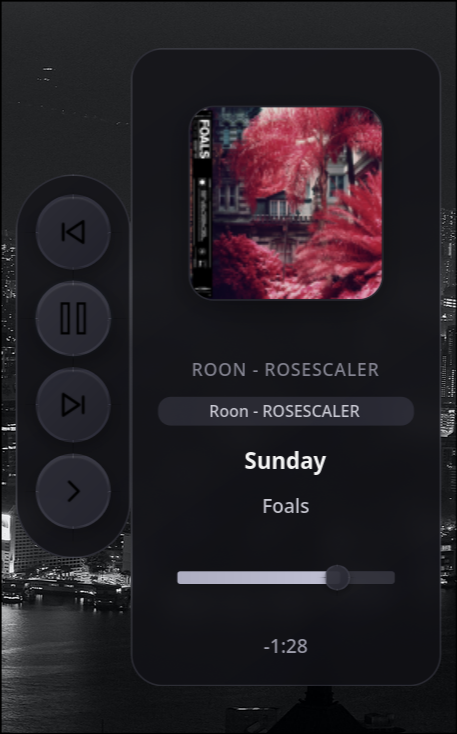
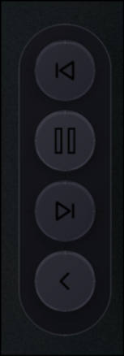
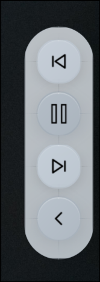
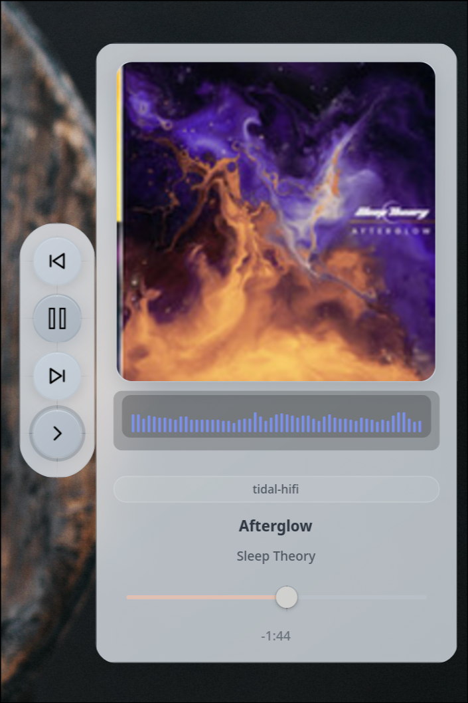

# HyprWave HiFi

HyprWave HiFi is a GTK4/Wayland music control overlay with MPRIS controls,
per-application volume, PipeWire-native visualization, album art, notifications,
and vertical idle display support.

This repository is the HiFi fork of upstream
[hyprwave](https://github.com/shantanubaddar/hyprwave). Upstream release,
and `github:shantanubaddar/hyprwave` Nix instructions refer to the original
project unless explicitly stated otherwise. Use this repository URL or the
`hyprwave-hifi` package name when you want the HiFi fork changes.

<p align="center">
  
</p>

## Fork Differences

| Area | Upstream hyprwave | HyprWave HiFi |
| --- | --- | --- |
| Volume control | General player/system-oriented volume | Per-application sink-input control with MPRIS fallback |
| Visualizer backend | PulseAudio-oriented upstream path | PipeWire native API for capture |
| Visualizer targeting | System audio-oriented | Attempts to target the active MPRIS player's audio |
| Vertical layouts | Dot matrix idle display | Dot matrix idle display plus expanded-section visualizer support |
| Themes in this checkout | Upstream ships a larger theme set | This fork ships base light styling plus CSS files under `themes/` |
| Player preference | Config preference list upstream | Last selected player is persisted in `~/.config/hyprwave/preferred_player` |

## Features

- Per-application volume using PipeWire/Pulse sink-inputs via `pactl`, with MPRIS fallback.
- PipeWire-native visualizer with automatic gain control.
- MPRIS playback controls for Spotify, Roon, VLC, browsers, and other compatible players.
- Click/drag progress seeking when the active player supports seeking.
- Album art and metadata display.
- Right, left, top, and bottom layer-shell layouts.
- Vertical dot matrix idle display.
- Now-playing notifications.
- Tight Wayland input regions so transparent layer areas do not block desktop clicks.
- Light base styling and optional theme CSS.

## Screenshots

<table>
<tr>
<td align="center"><strong>Dark Collapsed</strong></td>
<td align="center"><strong>Dark Expanded</strong></td>
<td align="center"><strong>Light Collapsed</strong></td>
<td align="center"><strong>Light Expanded</strong></td>
</tr>
<tr>
<td></td>
<td></td>
<td></td>
<td></td>
</tr>
</table>

## Installation

### Dependencies

Build dependencies:

```bash
# Arch Linux
sudo pacman -S base-devel gtk4 gtk4-layer-shell pipewire libsoup3 libpulse

# Ubuntu / Debian
sudo apt install build-essential pkg-config libgtk-4-dev gtk4-layer-shell libpipewire-0.3-dev libgdk-pixbuf-2.0-dev libsoup-3.0-dev pulseaudio-utils

# Fedora
sudo dnf install gcc make pkgconf-pkg-config gtk4-devel gtk4-layer-shell-devel pipewire-devel gdk-pixbuf2-devel libsoup3-devel pulseaudio-utils
```

Runtime notes:

- PipeWire must be running for visualization.
- `pactl` is required for per-application volume. On PipeWire systems this is
  normally provided by PulseAudio compatibility packages such as `libpulse` or
  `pulseaudio-utils`; `pipewire-pulse` provides the compatible server.

### Source Install

```bash
git clone https://github.com/godlyfast/hyprwave-hifi.git
cd hyprwave-hifi
make
make install
```

`make install` installs:

- `hyprwave` to `~/.local/bin/hyprwave`
- `hyprwave-toggle` to `~/.local/bin/hyprwave-toggle`
- resources to `~/.local/share/hyprwave/`

The app creates `~/.config/hyprwave/config.conf` on first run if it does not
already exist.

### Nix

This fork's flake builds the local checkout:

```bash
nix build
nix run
```

From GitHub, use the fork URL:

```bash
nix run github:godlyfast/hyprwave-hifi
```

The upstream package remains available separately as
`github:shantanubaddar/hyprwave`.

### AUR

This fork is published on AUR as `hyprwave-hifi`:

```bash
yay -S hyprwave-hifi
```

For a package that tracks the latest `main` branch, use:

```bash
yay -S hyprwave-hifi-git
```

Both fork packages provide `hyprwave` and conflict with the upstream `hyprwave`
package, so keep only one installed. `yay -S hyprwave` still targets the
original upstream package.

## Usage

Start HyprWave, then start any MPRIS-compatible music player:

```bash
hyprwave
```

The toggle helper talks to the running process with Unix signals:

```bash
hyprwave-toggle visibility
hyprwave-toggle expand
hyprwave-toggle play
hyprwave-toggle next
hyprwave-toggle prev
```

If HyprWave is not running, `hyprwave-toggle visibility` auto-starts it when the
binary is available in `PATH` or `~/.local/bin`. Media actions require a running
HyprWave instance and an active MPRIS player.

## Keybinds

Bind the helper script in your compositor config.

### Hyprland

```conf
bind = SUPER_SHIFT, M, exec, hyprwave-toggle visibility
bind = SUPER, M, exec, hyprwave-toggle expand
bind = , XF86AudioPlay, exec, hyprwave-toggle play
bind = , XF86AudioNext, exec, hyprwave-toggle next
bind = , XF86AudioPrev, exec, hyprwave-toggle prev
```

Reload with `hyprctl reload`.

### Niri

```kdl
binds {
    Mod+Shift+M { spawn "hyprwave-toggle" "visibility"; }
    Mod+M { spawn "hyprwave-toggle" "expand"; }
    XF86AudioPlay { spawn "hyprwave-toggle" "play"; }
    XF86AudioNext { spawn "hyprwave-toggle" "next"; }
    XF86AudioPrev { spawn "hyprwave-toggle" "prev"; }
}
```

Reload with `niri msg action reload-config`.

### Sway

```conf
bindsym $mod+Shift+M exec hyprwave-toggle visibility
bindsym $mod+M exec hyprwave-toggle expand
bindsym XF86AudioPlay exec hyprwave-toggle play
bindsym XF86AudioNext exec hyprwave-toggle next
bindsym XF86AudioPrev exec hyprwave-toggle prev
```

Reload with `swaymsg reload`.

## Auto-Start

```conf
# Hyprland
exec-once = hyprwave
```

```kdl
// Niri
spawn-at-startup "hyprwave"
```

## Configuration

Edit `~/.config/hyprwave/config.conf`:

```conf
# HyprWave Configuration File

[General]
# Edge to anchor HyprWave to: right, left, top, bottom
edge = right

# Margin from the selected screen edge in pixels
margin = 10

# Theme: light or dark
theme = light

# Size: tiny, small, default, large
size = default

# Volume method: auto, pipewire, mpris
volume_method = auto

[Notifications]
enabled = true
now_playing = true

[Visualizer]
# Expanded-section visualizer in all layouts
enabled = true

# Horizontal layouts only: seconds before idle visualizer mode appears.
# Set to 0 to disable automatic idle visualizer mode.
idle_timeout = 30

[VerticalDisplay]
# Vertical layouts only: dot matrix idle display
enabled = true
idle_timeout = 5
```

The vertical dot matrix track-change scroll is constrained to the slim control
bar height so track and artist text stays inside the rounded idle display.

Player selection is not driven by `[MusicPlayer]` in this fork. The last chosen
MPRIS player is saved to `~/.config/hyprwave/preferred_player`.

### Layout Options

| Edge | Layout | Idle mode |
| --- | --- | --- |
| `right` / `left` | Vertical | Dot matrix display |
| `top` / `bottom` | Horizontal | Visualizer bar |

The expanded section can show the visualizer in both vertical and horizontal
layouts when the active player's audio stream can be matched.

### Volume Methods

| Method | Behavior |
| --- | --- |
| `auto` | Try PipeWire/Pulse sink-input control first, then fall back to MPRIS volume |
| `pipewire` | Require a matching sink-input; useful for Chromium/Electron players |
| `mpris` | Use only the player's MPRIS `Volume` property |

## Themes

The base stylesheet is `style.css`. `theme = light` uses that base style.
`theme = dark` loads `themes/dark.css`.

Additional community theme snippets live in [THEMES.md](THEMES.md). In this fork
they are examples to copy into a CSS file, not built-in toggle targets. The
current `hyprwave-toggle` helper does not provide upstream's dynamic
`set-theme` command.

## Troubleshooting

### Black Box Around HyprWave

For Hyprland, disable blur on the layer surfaces:

```conf
layerrule = noblur, hyprwave
layerrule = noblur, hyprwave-notification
```

### Visualizer Not Showing

1. Confirm PipeWire is running: `systemctl --user status pipewire`.
2. Confirm `[Visualizer] enabled = true`.
3. Play audio from the selected MPRIS player.
4. If the player has no matching sink-input, the visualizer may stay hidden.

### Volume Control Not Working

Check `pactl` first:

```bash
which pactl
pactl list sink-inputs
```

If no matching sink-input is found, use `volume_method = mpris` for players with
a working MPRIS `Volume` property, or leave `volume_method = auto` for fallback.

## Technical Details

- Language: C11
- GUI: GTK4
- Layer shell: gtk4-layer-shell
- Player control: D-Bus MPRIS2
- Visualizer: libpipewire native capture with AGC
- Per-application volume: `pactl` sink-input control with MPRIS fallback
- Install resources: local checkout, `~/.local/share/hyprwave/`, then `/usr/share/hyprwave/`
- Memory target: roughly 80-95 MB idle
- CPU target: below 0.3% idle on the author's setup

### AGC Parameters

| Parameter | Value | Purpose |
| --- | --- | --- |
| Attack | `0.9` | Fast response to louder audio |
| Decay | `0.9995` | Slow decay during quiet parts |
| Min threshold | `0.0001` | Avoid amplifying silence |

## Credits

- Original project: [hyprwave](https://github.com/shantanubaddar/hyprwave) by shantanubaddar
- GTK4: [gtk.org](https://gtk.org/)
- Layer shell: [gtk4-layer-shell](https://github.com/wmww/gtk4-layer-shell)
- Audio: [PipeWire](https://pipewire.org/)

## Contributing

- Report fork-specific bugs via [GitHub Issues](https://github.com/godlyfast/hyprwave-hifi/issues)
- Send upstream-only issues to [shantanubaddar/hyprwave](https://github.com/shantanubaddar/hyprwave)
- Share custom themes and screenshots on [r/hyprwave](https://www.reddit.com/r/hyprwave/)

## License

GPL-3.0. See [LICENSE](LICENSE).
